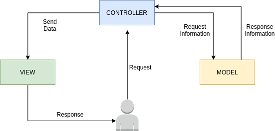
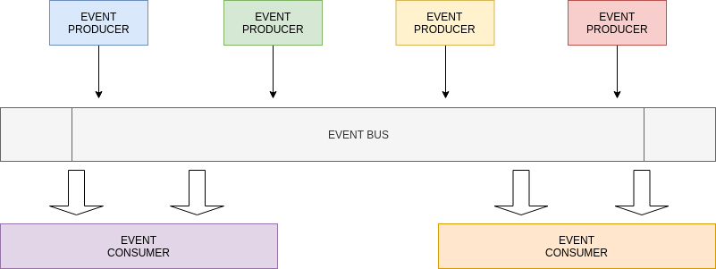
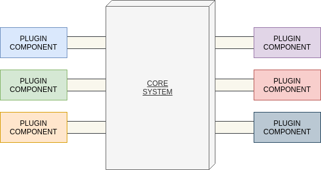
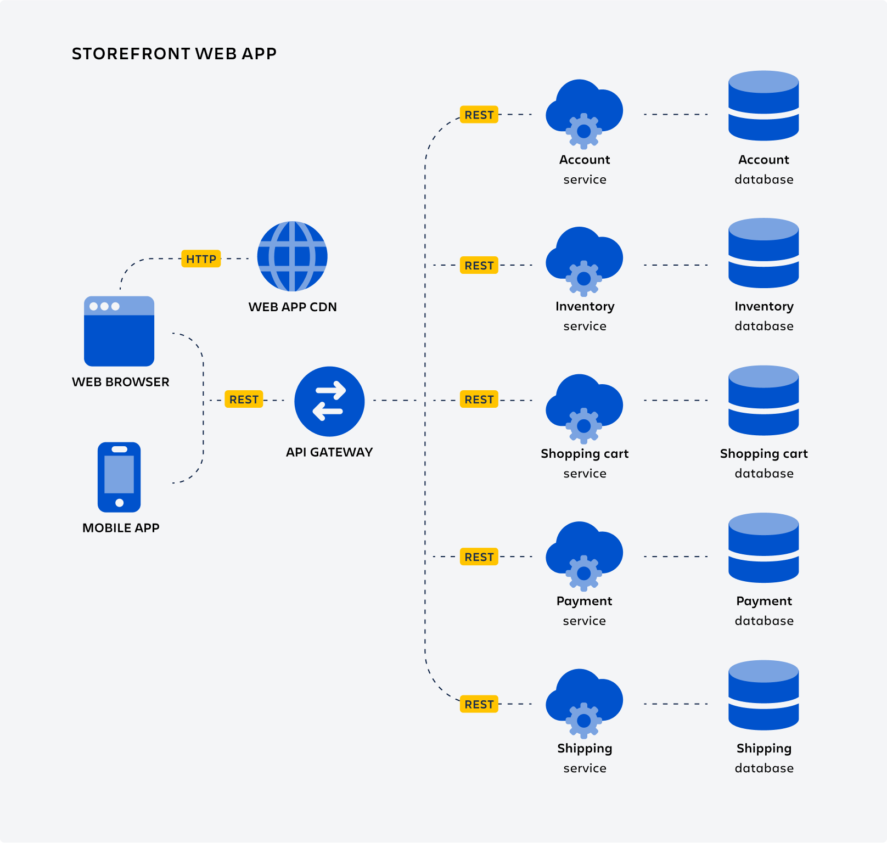

# 💻Arquitectura de Software

## ¿Que es?
Es el diseño de un sistema de software, que define sus **componentes**, **relaciones** e **interaccion**.

## Tipos

Arquitectura Monolítica

Todo el sistema funciona en un único componente

Arquitectura Cliente-Servidor

El sistema se divide en dos componentes, el cliente que solicita servicios a un servidor y funciona como interfaz para el usuario; y el servidor que provee estos servicios al cliente.

Arquitectura Distribuida

El sistema es dividido en varios componentes que se ejecutan en distintas máquinas.

Arquitectura Orientada a Servicios

El sistema se divide en servicios que pueden ser proporcionados por distintos proveedores, estos servicios se comunican entre sí.

## Importancia

- Garantiza que un sistema sea robusto.

- Permite la escalabilidad del sistema, podra adapdarse a las necesidades cambiantes.

- Facilita la mantenibilidad del sistema, haciendolo facil de entender y modificar.

# 🖌️Patrones de Diseño

## ¿Que son?
Son <mark style="background-color: #c7f6d4;">soluciones habituales</mark> a problemas recurrentes en el diseño de software.

▶️ No es una porcion especifica de codigo, es un concepto general para resolver un problema particular

> Son planos ya testeados que se pueden personalizar para resolver un problema especifico.

## Clasificacion
Los patrones se clasifican por su proposito u objetivo.

1️⃣ **Patrones Creacionales**: su objetivo es proporcionar mecanismos para crear objetos y clases flexibles y reutilizables.

2️⃣ **Patrones Estructurales**: explican la forma en que se deben construir los objetos y las clases en estructuras mas grandes.

3️⃣ **Patrones de Comportamiento**: se encargan de definir la comunicacion, interaccion y las responsabilidades entre los objetos.

## Patrones mas Usados

### Factory Method
Es un patron de diseño creacional que nos proporciona una interfaz para crear objetos usando una superclase, que permite a sus subclases usar la misma interfaz para crear objetos diferentes.

> :bulb:
> En este caso tenemos una superclase llamada logistica, con toda la info base para realizar la logistica de envios. Esta superclase es la que nos proporciona la interfaz para crear objetos distintos como una logistica terrestre y una logistica maritima con propiedades en comun de la superclase y a la vez propias.

### Singleton
Es un patrón también creacional que nos asegura que una clase u objeto se crea una sola vez, es decir, tiene una única instancia. Esto permite que el objeto sea compartido y accedido de manera global.

⚠️ Este patrón es imposible de usar en un constructor normal, ya que al llamar al constructor, siempre se devolverá una nueva instancia.

⏫ Nos da la posibilidad de acceder a un objeto desde cualquier parte del programa, a la vez que evita que otro código sobrescriba esa instancia.

### Chain of responsability
Es un patron de diseño de comportamiento, el cual estructura las solicitudes en una cadena de manejadores/controladores. Cada manejador decide como procesar esta solicitud, sí bloquearla o pasarla al siguiente manejador.

> :bulb:
> Por ejemplo podrias tener un sistema de login en una app de pedidos, el cual deseas permitir el acceso solo a usuarios autenticados, de forma que puedan hacer pedidos. Ademas de que los usuarios administrativos tengan acceso a todo el sistema.

> Las comprobaciones se deberian hacer de forma secuencial. La app intentara autenticar a un usuario al recibir la solicitud con sus credenciales, sí son correctas continuara con otra validacion de token, y luego de cache, etc; hasta que tenga acceso al sistema de pedidos. Cada una de estas validaciones son un manejador.

# :bricks:Patrones Arquitectonicos

Son un marco de referencia que se usa para definir y construir sistemas de software.

## Ventajas
### 🥇Cambios iniciales en el diseño 
La mayoría de los patrones arquitectónicos permiten realizar ajustes en las etapas tempranas de diseño, dando la oportunidad de crear un patrón flexible y robusto que evite futuros errores.

### 🥈Sistemas optimizados
Gracias a los patrones de arquitectura se pueden construir modelos reutilizables que proporcionan una estructura escalable y que puede ser optimizada las veces que sean necesarias.

### 🥉Puente de comunicación
Un patrón de arquitectura de software sirve, entre sus principales funciones, como base para la comunicación entre los distintos elementos.

## 📂Patrones mas Usados

###  Arquitectura por capas
Se basa en el enfoque por niveles. Cada nivel presta un servicio especifico al nivel superior. Su punto central es la persistencia de la informacion en la base de datos.

✍️ La estructura de esta arquitectura mas usada es el MVC (Model View Controller), estas son sus capas:

#### 1. Capa de Persistencia (Base de datos)
Es la capa inferior donde se almacena la informacion, ya sea en una base de datos o en memoria.

#### 2. Capa de Logica (Modelo)
Tenemos toda la logica perteneciente a nuestro negocio, el mapeo con la base de datos, la definicion de relaciones, funcionamiento de las entidades, etc.

#### 3. Capa Intermedia (Controlador)
Es la capa que recibe la peticion del usuario, en donde se contienen todas las reglas y metodos para transformar la peticion en una respuesta.

#### 4. Capa de Presentacion (Vista)
Es la capa superior donde se renderiza la vista a mostrar al usuario. Normalmente se usan tecnologias como HTML, CSS, JS y algun framework frontend.

### Arquitectura por Eventos
Los programas que usan esta arquitectura pasa el mayor tiempo 'esperando que algo ocurra (eventos)'. Un evento puede ser un click, un cambio de estado, etc.

- Esta pensado para aplicaciones basadas en datos asincronos
- Aplicaciones escalables

### Arquitectura MicroKernel
Esta basado en crear aplicaciones extensibles a traves de modulos o como son realmente llamados **plugins**
Este arquetipo esta dividido en dos componentes:

💙 **Sistema Central (Core)**

   Contiene los elementos esenciales para que la app funcione correctamente.

💙 **Modulos (Plugins)**

   Añaden caracteristicas/funcionalidades extras que se implementan en el core.

> Orientado a sistemas  que necesitan actualizarse con frecuencia y necesitan mantener una conexion constante entre diferentes funciones.

### Arquitectura de Micro-Servicios
Esta arquitectura viene a cambiar la idea de un sistema grande e incontrolable, por uno con una gran cantidad de programas pequeños que funcionan libremente.

- Facilita que las aplicaciones crezcan, sean flexibles y manejables sin afectar otros modulos (servicios) de la app.
- Cada microservicio puede asignar diferentes capacidades de procesamiento, persistencia, codigo, etc.

> 🤓
> Imagina por ejemplo netflix, cada interfaz es un microservicio, por ejemplo: la lista de favoritos, calificaciones, cada categoria de una serie o pelicula, la seccion de configuracion, etc.

> Si en algun momento alguno de estos servicios necesitan mas recursos de procesamiento porque el fin de semana hubo mas demanda de series de terror, se podra hacer facilmente.

# 👨‍💻Conceptos en Ingeniera de Software

## Atributos de Calidad 
Nos ayudan a garantizar que un sistema va a funcionar de forma estable, cumple con los requerimientos tecnicos y a su vez es capáz de satisfacer las necesidades del usuario.

### 1. Funcionalidad 
El software debe cumplir con las funciones implicitas y explicitas para el cual fue diseñado.
> 🔴
> Una calculadura, su funcionalidad implicita sera que al menos puedas sumar, restar, multiplicar y dividir numeros.

> 🟢
> De forma explicita se deberian manejar las excepciones, como por ejemplo que al dividir por 0 se regrese un mensaje amistoso de error.

🫤Pasa mucho encontrar funciones que no se usan y otras que el usuario require pero no existen.

### 2. Confiabilidad
Debemos asegurarnos de que nuestro sistema funcione de forma optima en cualquier ambiente y nivel de demanda.

😵‍💫 En mi maquina si funciona, elimina este pensamiento.

- Permite que tu aplicacion evolucione. Si algo ya funciona no significa que no pueda ser mejorado.
-
-
